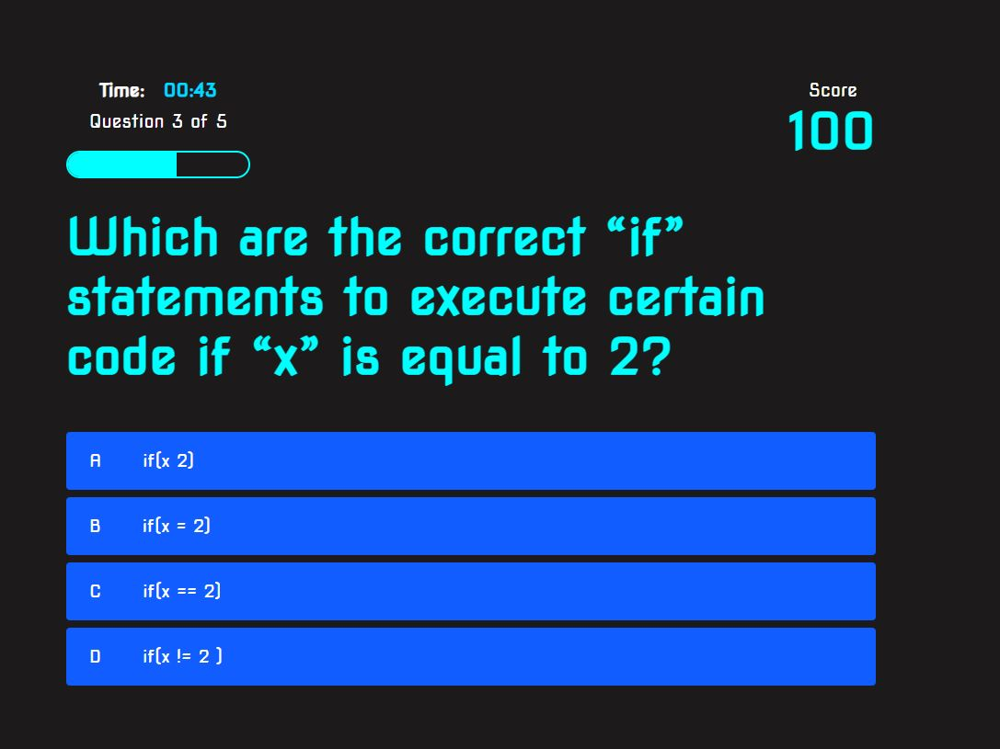

# Javascript-Quiz

## Short Javascript Quiz

This is a typical coding assessment which includes both multiple-choice questions and interactive coding challenges. This app will run in the browser and will feature dynamically updated HTML and CSS powered by JavaScript code. It will have a clean, polished, and responsive user interface. 

## Acceptance Criteria

```
GIVEN I am taking a code quiz
WHEN I click the start button
THEN a timer starts and I am presented with a question
WHEN I answer a question
THEN I am presented with another question
WHEN I answer a question incorrectly
THEN time is subtracted from the clock
WHEN all questions are answered or the timer reaches 0
THEN the game is over
WHEN the game is over
THEN I can save my initials and my score
```

## Screenshot

Screenshot that I have provided below using Snipping Tool


